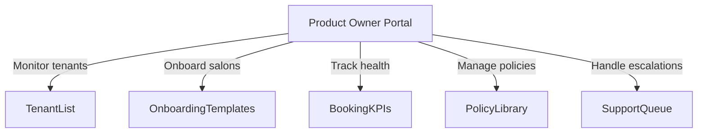
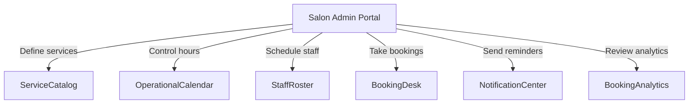
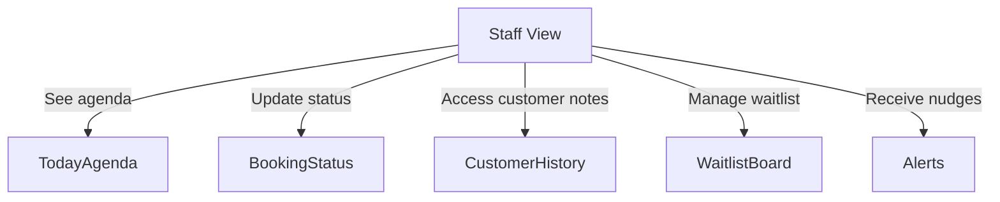

# Draft 1.2 – Booking Story + Portal Feature Maps

We are building a salon booking experience that feels warm, familiar, and deeply Indian. The focus for now is just one thing: make booking management super reliable. Everything else—tenant welcome, staff setup, customer profiles—exists only to get guests in and out without waste.

## What keeps salons awake at night (salon side problems)
- Time management is a real struggle when bookings pile up late in the evening. Staff feel stretched when they cannot see what is coming next.
- Overcrowding at the counter makes it hard to keep waiting guests calm; there is no handy way to know who should be called next.
- Every walk-in needs a manual call or ping to confirm that their turn is ready, and it takes precious minutes.
- Forecasting revenue or the upcoming appointments diary feels impossible—there is no live view of what tomorrow or the weekend looks like.
- Stylists frequently request leaves, but planners have no clean calendar view to agree on the right day for them to pause bookings.
- Reminders are still happening over phone, which is distracting during services. A digital nudge to the customer and stylist would solve a lot.
- Reschedule requests come in as phone calls or WhatsApp replies; the front desk crew spends time finding the booking and moving everything manually.

## The customer perspective (what they want)
- Customers need a confirmed time slot so they can fit the salon visit into their busy day.
- Long queues with no clarity about who is next eats into their patience.
- Booking should be fast. If they already visited before, they do not want to repeat every detail—quick reuse is key.
- They want to book for friends or family with a single action.
- Cancelling or rescheduling should not require paperwork; just a quick, understandable flow that works even on a phone.

## Booking flow we plan to craft
1. A guest reaches out (app, WhatsApp, phone, or walk-in) and we capture the booking in one shared place.
2. The system checks available stylists, buffers, and the salon’s working hours to suggest the earliest reliable slot.
3. The desk person or stylist approves the slot, customer gets a confirmation message, and the booking status updates to show everyone the next step.
4. Stylists can update status (checked-in, servicing, done) without opening another screen, and the front desk sees it in real time.
5. If something changes, we can reschedule or cancel with auto slot release, logging the reason and informing the guest again.

## How the portals help this journey
- **Product Owner portal:** keeps an eye on how many salons are live, what their booking policy templates look like, and whether any salon is facing booking hiccups. This is the quiet, staging area for the entire booking machine.
- **Tenant admin portal:** where the salon team sets their services, opens their calendar, tunes buffers, and runs the booking calendar. It is the main place to manage actual appointments.
- **Staff view:** a simple desk that shows each stylist’s today’s list, allows quick check-ins, and keeps them informed about urgent waitlist guests.

## Portal feature maps (Mermaid)
### Product Owner Portal features

### Tenant Admin Portal features

### Staff View features

## Extra touches for the booking MVP
- Make booking intake “channel-agnostic” so it does not matter whether the guest called, pinged on WhatsApp, or walked in—the booking object stays the same.
- When someone cancels, automatically push that slot to the waitlist and notify the next customer that something just opened up.
- Allow regional booking policy templates (e.g., city-wise cancellation notice, Hindi/English reminders) so we keep our Indian guests comfortable.
- Tag customers with loyalty or reputation markers so risky guests can be asked for upfront payment, while regulars flow through quickly.
- Always show the last few bookings and notes while creating a new one, so stylists can nod and say “sir, same style again?” without scrolling through separate files.

## What to do next
- Share this human-friendly draft with your team so they feel confident about what “booking management only” really means for the salon and customer.
- Use this version as the base for conversations with operations, and once the scope is firm, convert each section into developer-ready stories.
