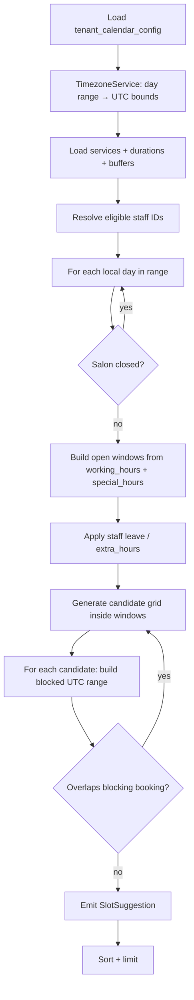

# Availability Calculation Engine

**Purpose:** Single component that answers “which slots are bookable?” and “is this slot still free?” by combining schedules, holidays, leaves, buffers, timezones, resources, existing bookings, and concurrency rules.

**Consumers:** `GET /availability/slots`, `POST /bookings`, `PUT /bookings/:id/reschedule`, `BookingService` (internal).

**Related:** [Calendar-Booking-Solutions.md](./Calendar-Booking-Solutions.md), [DB-Design-Booking-Calendar.md](./DB-Design-Booking-Calendar.md), [user-stories/04-service-availability.md](./user-stories/04-service-availability.md)

---

## 1. Design principles

| Principle | Rule |
| --- | --- |
| **Single brain** | No controller/service duplicates slot math; all paths call `AvailabilityEngine`. |
| **Tenant scoped** | Every load/filter includes `tenant_id` from `AsyncContextService` (never from client body). |
| **UTC inside, local outside** | Wall-clock rules use **tenant TZ**; comparisons and storage use **UTC instants**. |
| **Blocked interval** | A slot occupies `[blockedStart, blockedEnd)` including buffers — same range used for GiST on `booking`. |
| **Read vs write** | `suggestSlots` = read-optimized; `assertSlotAvailable` = write-optimized + must align with GiST exclusion. |
| **Deterministic** | Same inputs + same DB state → same slots (no randomness). |

---

## 2. Component boundaries

```text
┌─────────────────────────────────────────────────────────────┐
│                    AvailabilityEngine                        │
│  suggestSlots()     assertSlotAvailable()   findConflicts() │
└────────────┬───────────────────────────────┬────────────────┘
             │                               │
    ┌────────▼────────┐            ┌─────────▼─────────┐
    │  TimezoneService  │            │ BookingRepository │
    │  (IANA, DST-safe) │            │ (blocking ranges) │
    └────────┬──────────┘            └─────────┬─────────┘
             │                               │
    ┌────────▼───────────────────────────────▼─────────┐
    │ CalendarConfigRepository │ ServiceRepository      │
    │ StaffAvailabilityRepo    │ ServiceStaffRepo     │
    └──────────────────────────────────────────────────┘
```

| Component | Owns | Does NOT own |
| --- | --- | --- |
| `AvailabilityEngine` | Slot pipeline, resource filtering, buffer math | Payment, notifications, policy fees |
| `TimezoneService` | Local ↔ UTC, day boundaries, DST edges | Business hours JSON shape |
| `BookingRepository` | Overlap queries, `FOR UPDATE` on write path | Generating grid steps |
| DB GiST constraint | Hard overlap on commit | Suggesting alternates |

---

## 3. Public API (TypeScript contract)

```typescript
/** Input for slot search */
export interface SuggestSlotsRequest {
  serviceIds: string[];           // at least one bookable service
  staffId?: string;               // MVP: optional but recommended
  localFromDate: string;          // YYYY-MM-DD in tenant calendar
  localToDate?: string;           // default: from + 7 days
  limit?: number;                 // default 20
  excludeBookingId?: string;      // reschedule: ignore self
}

export interface SlotSuggestion {
  startAt: string;                // ISO UTC
  endAt: string;                  // ISO UTC (includes buffers — blocked end)
  startAtLocal: string;           // ISO local or structured for UI
  endAtLocal: string;
  staffId: string;
  staffName?: string;
  timezone: string;               // IANA
  totalDurationMin: number;       // customer-visible service time
  blockedDurationMin: number;     // includes buffers
}

export interface AssertSlotRequest {
  serviceIds: string[];
  staffId: string;                // MVP: required on write
  startAt: string;                // UTC instant OR local pair — pick one contract
  excludeBookingId?: string;
}

export interface AssertSlotResult {
  ok: true;
  blockedStartAt: string;       // UTC — persist as booking.start_at - bufferBefore
  blockedEndAt: string;         // UTC — persist as booking.end_at (GiST range)
  pricingPreview?: PricingSnapshot;
}

export class AvailabilityEngine {
  suggestSlots(req: SuggestSlotsRequest): Promise<SlotSuggestion[]>;
  assertSlotAvailable(req: AssertSlotRequest): Promise<AssertSlotResult>;
  /** Used after 409 — return next N slots near requested time */
  suggestAlternates(req: AssertSlotRequest, count?: number): Promise<SlotSuggestion[]>;
}
```

**Errors (throw `HttpException` or domain errors mapped in service):**

| Code | When |
| --- | --- |
| `ERR_SERVICE_INACTIVE` | Service not active or wrong tenant |
| `ERR_STAFF_NOT_ELIGIBLE` | Staff not in `service_staff` |
| `ERR_STAFF_ON_LEAVE` | Leave covers entire slot |
| `ERR_SALON_CLOSED` | Day off or closed weekday |
| `ERR_SLOT_CONFLICT` | Overlaps blocking booking (write path) |
| `ERR_OUTSIDE_WORKING_HOURS` | Slot outside open windows |
| `ERR_AMBIGUOUS_LOCAL_TIME` | DST ambiguous local time (P2+) |
| `ERR_INVALID_TIME_RANGE` | Malformed dates |

---

## 4. Calculation pipeline

High-level flow for **`suggestSlots`**:



### Step 0 — Load context (tenant-scoped)

```text
tenantId = AsyncContextService.getTenantId()
config   = CalendarConfigRepository.findByTenantId(tenantId)
timezone = config.timezone
services = ServiceRepository.findActiveByIds(tenantId, serviceIds)
```

Validate: all services exist, `service_type = service`, `is_active`.

---

### Step 1 — Timezone & day range

**Concern:** timezone, DST

```text
{ fromUtc, toUtcExclusive } = TimezoneService.toUtcDayRange(timezone, localFromDate, localToDate)
```

- Iterate **local calendar days** from `localFromDate` to `localToDate` (inclusive) using tenant TZ.
- Never use server default TZ or `Date()` without zone.

**DST (P2+):** On gap/overlap days, `TimezoneService` throws or skips invalid local times; engine does not interpret offsets manually.

**MVP (India):** `Asia/Kolkata` — no DST transitions; still use IANA for future tenants.

---

### Step 2 — Duration & buffer budget

**Concern:** buffers

```text
totalServiceMin = sum(service.duration_min)
completionBufferMin = sum(service.completion_buffer_min)  // per service after each, or max — document: use sum
bufferBefore = config.buffer_before_min
bufferAfter = config.buffer_after_min + completionBufferMin

customerDuration = totalServiceMin
blockedDurationMin = bufferBefore + totalServiceMin + bufferAfter
```

**Grid step:** `config.slot_duration_min` (e.g. 15) — candidate starts every step minutes within windows.

**Customer-facing start** = grid tick; **blocked interval**:

```text
blockedStartLocal = candidateStartLocal - bufferBefore
blockedEndLocal   = candidateStartLocal + totalServiceMin + bufferAfter
→ convert both to UTC for comparison and persistence
```

`booking.start_at` = customer start (UTC); `booking.end_at` = blocked end (UTC) — matches [DB design](./DB-Design-Booking-Calendar.md).

---

### Step 3 — Resources (staff)

**Concern:** resources

```text
if staffId provided:
  eligibleStaff = [staffId] if passes eligibility check
else:
  eligibleStaff = intersection(service_staff for all serviceIds) ∩ active users
```

**Eligibility check:**

- User exists, same `tenant_id`, active status
- Listed on every requested service in `service_staff`
- Not on full-day leave for that local date (see step 5)

**P2+:** multiple resource types (room, chair) → extend with `ResourceAllocator`.

---

### Step 4 — Schedules (weekly template)

**Concern:** schedules

For local day `D`, weekday `W`:

```text
template = config.working_hours[W]
if !template.isOpen → skip day
openWindows = [{ open, close }] minus template.breaks
```

Times are **local wall clock** in `timezone`.

---

### Step 5 — Holidays & day-off

**Concern:** holidays

```text
override = config.day_overrides.find(date == D)
if override.type == 'closed' → skip day
if override.type == 'special_hours' → replace openWindows with override open/close/breaks
```

Salon-level only; does not remove individual staff unless combined with leave.

---

### Step 6 — Leaves & staff exceptions

**Concern:** leaves

```text
row = StaffAvailabilityRepository.find(staffId, D)
if row.exception_type == 'leave' && allDay → staff unavailable entire day
if row.exception_type == 'break' → subtract break windows from openWindows
if row.exception_type == 'extra_hours' → add windows (intersect with salon hours unless admin_override)
```

Apply **per staff** inside the day loop (outer loop: staff, inner: day — or day then staff; choose one and keep stable).

---

### Step 7 — Generate candidates

**Concern:** slot generation

```text
for each openWindow [windowStart, windowEnd):
  t = windowStart
  while t + blockedDurationMin <= windowEnd:
    if t >= now + config.min_booking_notice_min:
      candidates.add(t)
    t += config.slot_duration_min
```

Filter `now` in **tenant local** converted to comparable instant.

---

### Step 8 — Overlaps (existing bookings)

**Concern:** overlaps, concurrency (read path)

For each candidate, UTC range `[blockedStartUtc, blockedEndUtc)`:

```sql
SELECT 1 FROM booking
WHERE tenant_id = :tenantId
  AND staff_id = :staffId
  AND deleted_at IS NULL
  AND status IN (:blockingStatuses)
  AND tstzrange(start_at, end_at, '[)') && tstzrange(:blockedStart, :blockedEnd, '[)')
  AND (:excludeId IS NULL OR id <> :excludeId)
LIMIT 1;
```

**Blocking statuses:** `pending`, `confirmed`, `checked_in`, `servicing`.

**Concurrency (read):** READ COMMITTED is enough for suggest — slight staleness possible; write path is authoritative.

**Concurrency (write):** `assertSlotAvailable` runs same overlap check **inside transaction**, then `INSERT`; GiST catches races.

Optional optimization: load all blocking ranges for `(tenantId, staffId, utcDayRange)` once per day into memory interval tree — MVP can use query per candidate or one bulk query + in-memory merge.

**Bulk query pattern (recommended):**

```text
ranges = BookingRepository.findBlockingRanges(tenantId, staffId, fromUtc, toUtcExclusive)
for candidate in candidates:
  if !intervalTree.overlaps(candidate.blockedRange, ranges) → emit slot
```

---

### Step 9 — Output

Sort by `startAt`, apply `limit`, map to `SlotSuggestion` with local display fields from `TimezoneService`.

---

## 5. Write path — `assertSlotAvailable`

Used by `POST /bookings` and reschedule **inside** `QueryRunner` transaction:

```text
1. Re-run steps 0–2 (validate services, compute blocked range from requested startAt)
2. Validate staff eligibility + not on leave (steps 3–6 for that instant/day)
3. Validate within working hours (step 4–5 for that day)
4. SELECT blocking bookings FOR UPDATE (same overlap SQL)
5. If overlap → throw ERR_SLOT_CONFLICT + suggestAlternates()
6. Return AssertSlotResult with blockedStartAt/blockedEndAt for INSERT
7. INSERT booking — GiST exclusion as final safety net
```

| Layer | Role |
| --- | --- |
| Engine step 4–5 | Friendly errors before DB |
| `FOR UPDATE` | Serializable overlap read in TX |
| GiST `EXCLUDE` | Guaranteed no double book if app bug |

---

## 6. Concern → pipeline step map

| Concern | Where handled | MVP |
| --- | --- | --- |
| **Schedules** | Step 4 `working_hours` | Yes |
| **Holidays** | Step 5 `day_overrides` | Yes |
| **Overlaps** | Step 8 + write `FOR UPDATE` + GiST | Yes |
| **Leaves** | Step 6 `staff_availability` | Yes |
| **Buffers** | Step 2 blocked interval | Yes |
| **Timezone** | Step 1 `TimezoneService` | Yes |
| **DST** | `TimezoneService` IANA | IST-only tests MVP |
| **Resources** | Step 3 `service_staff` + `staff_id` | Stylist only |
| **Concurrency** | Bulk overlap read + TX + GiST | Yes |

---

## 7. `TimezoneService` requirements (engine dependency)

```typescript
interface TimezoneService {
  /** Inclusive local dates → UTC range for DB queries */
  toUtcDayRange(tz: string, fromLocal: string, toLocal: string): { fromUtc: Date; toUtcExclusive: Date };

  /** Local date + HH:mm → UTC Date */
  toUtc(tz: string, localDate: string, localTime: string): Date;

  /** UTC → display DTO */
  toLocalParts(tz: string, utc: Date): { date: string; time: string; offset: string };

  /** Add minutes in local wall clock (for buffer shift) */
  addLocalMinutes(tz: string, localDate: string, localTime: string, minutes: number): LocalDateTime;

  /** P2: detect ambiguous/skipped local times */
  validateLocalDateTime(tz: string, localDate: string, localTime: string): void;
}
```

Engine **never** calls `new Date(string)` without timezone context.

---

## 8. Caching & real-time

| Operation | Cache |
| --- | --- |
| `suggestSlots` | Optional 30s TTL key `avail:{tenantId}:{staffId}:{from}:{to}:{serviceHash}` |
| `assertSlotAvailable` / booking write | **No cache** |
| After booking commit | Invalidate all `avail:{tenantId}:*` for that staff + date range |

Config changes (`PUT /slots/config`, staff leave POST) → invalidate tenant `avail:{tenantId}:*`.

---

## 9. File layout (Nest)

```text
libs/@anvix/business-core/modules/availability/
  ├── availability-engine.service.ts      # pipeline orchestrator
  ├── availability-engine.types.ts
  ├── interval-tree.helper.ts             # optional overlap merge
  ├── timezone.service.ts                 # or @core-utilities if shared
  └── dto/                                # if HTTP exposes slots

libs/@anvix/business-core/modules/booking/
  └── booking.repository.ts               # findBlockingRanges, lockOverlapping

libs/@anvix/server-core/database/entities/
  └── (per DB design)
```

`AvailabilityModule` exports `AvailabilityEngine`, `TimezoneService`; imported by `BookingModule`, `ServiceModule`.

---

## 10. Testing strategy

| Test | Validates |
| --- | --- |
| Unit: closed Sunday | schedules + holidays |
| Unit: leave Friday | leaves |
| Unit: 30+15 buffer | buffers |
| Unit: IST 09:00 → UTC | timezone |
| Unit: two bookings overlap | overlaps |
| Integration: parallel POST /bookings | concurrency + GiST |
| Integration: reschedule exclude self | overlaps excludeBookingId |

---

## 11. MVP vs later

| Feature | MVP | Later |
| --- | --- | --- |
| Multi-staff search without `staffId` | Try all eligible | Performance: parallel |
| DST edge cases | IST tenant only | Full matrix |
| Recurring availability | N/A | RRULE expansion into days |
| External busy blocks | N/A | `external_busy_block` table |
| Room/chair resources | N/A | Multi-resource CSP |
| Precomputed slot table | N/A | Materialized `availability_slot` |

---

## 12. HTTP surface

| Endpoint | Engine method |
| --- | --- |
| `GET /availability/slots` | `suggestSlots` |
| `POST /bookings` | `assertSlotAvailable` (in TX) |
| `PUT /bookings/:id/reschedule` | `assertSlotAvailable` + `excludeBookingId` |

---

## 13. Summary

The **Availability Calculation Engine** is a **deterministic pipeline**:

1. Resolve **tenant timezone** and **local day range** → UTC bounds.  
2. Compute **service duration + buffers** → blocked interval length.  
3. Filter **resources** (staff ∩ services).  
4. Build **open windows** from **schedules**, minus **holidays**, adjusted for **leaves**.  
5. **Generate grid** candidates.  
6. Remove **overlaps** with blocking **bookings** (bulk query + interval check).  
7. On write, repeat overlap inside **transaction**; **GiST** enforces **concurrency** at commit.

All nine concerns are composed in this order — not scattered across controllers.

*Implement `TimezoneService` first, then engine read path, then write path + GiST migration.*
