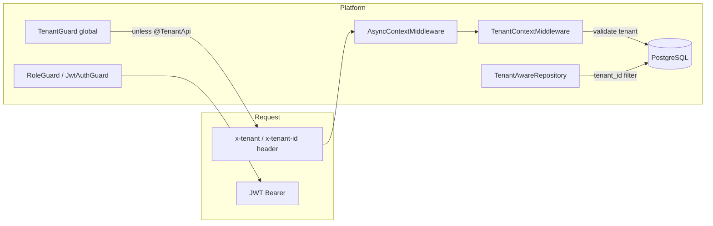
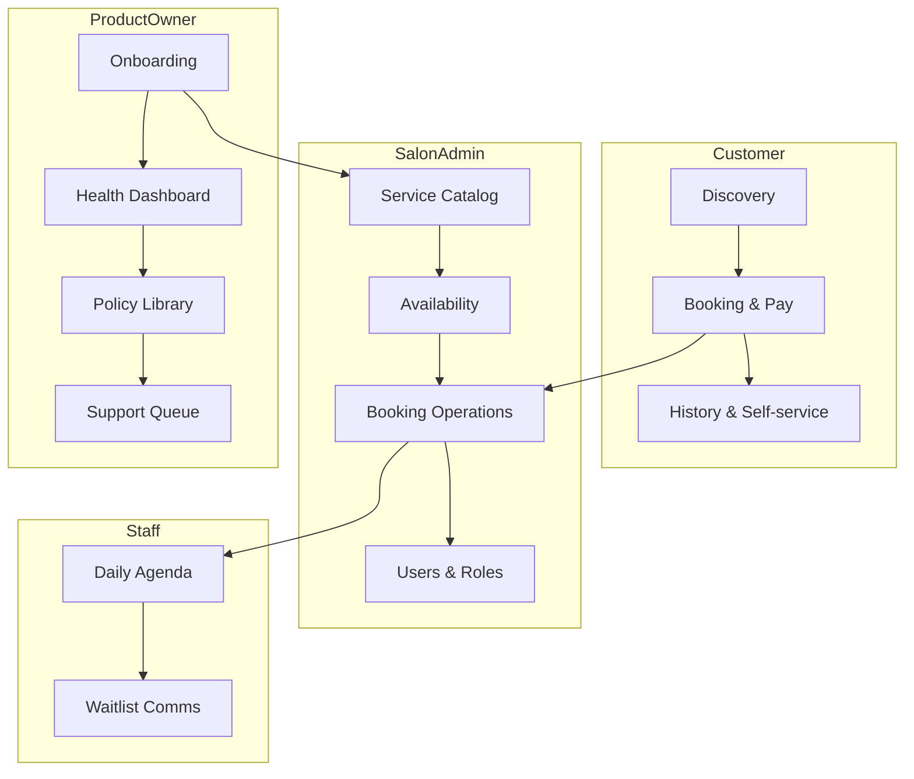
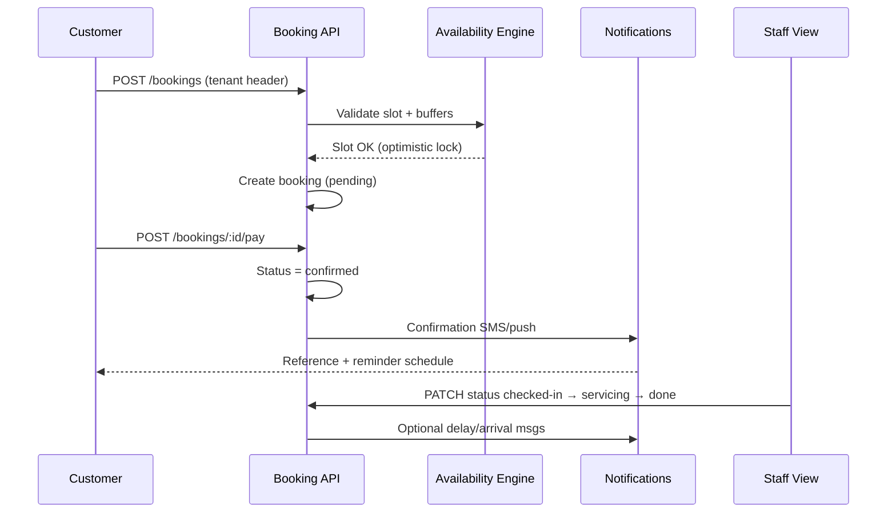
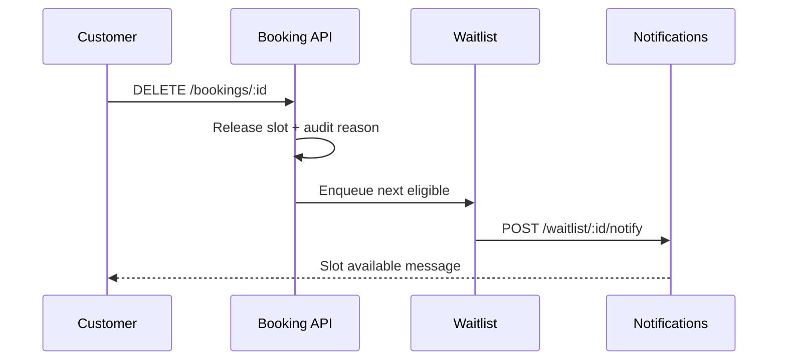
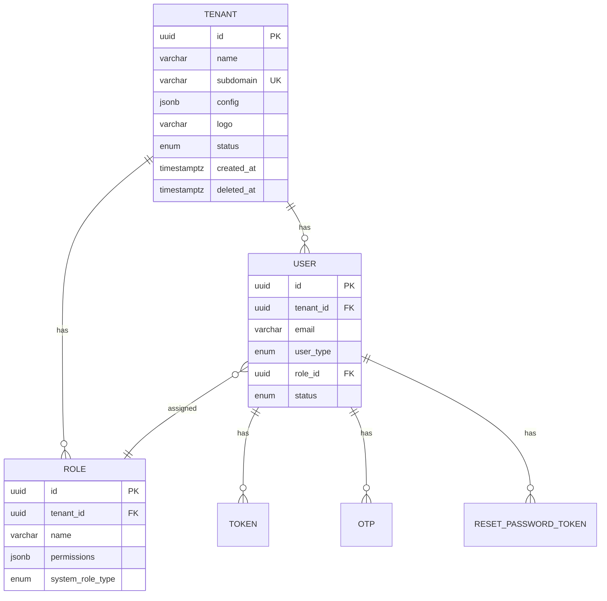

# Business Requirements Document (BRD)
## Anvix — Multi-Tenant Salon Booking Platform (India MVP)

| Field | Value |
| --- | --- |
| **Document ID** | BRD-ANVIX-SALON-001 |
| **Version** | 1.0 |
| **Status** | Draft for review |
| **Author** | Product / BA |
| **Last updated** | 2026-05-20 |
| **Related docs** | `docs/draft/Draft 1.2.md`, `docs/portals/*`, `docs/draft/Implementation TODO.md` |

---

## Table of contents

1. [Executive summary](#1-executive-summary)
2. [Document control & glossary](#2-document-control--glossary)
3. [Business requirements (BRD)](#3-business-requirements-brd)
4. [Multi-tenancy & security model](#4-multi-tenancy--security-model)
5. [Personas & portals](#5-personas--portals)
6. [Process flows](#6-process-flows)
7. [Functional requirements](#7-functional-requirements)
8. [Non-functional requirements](#8-non-functional-requirements)
9. [User stories & acceptance criteria](#9-user-stories--acceptance-criteria)
10. [API contract specification](#10-api-contract-specification)
11. [A/B testing & experimentation](#11-ab-testing--experimentation)
12. [Database design](#12-database-design)
13. [Traceability matrix](#13-traceability-matrix)
14. [Release roadmap & dependencies](#14-release-roadmap--dependencies)
15. [Open questions & decision log](#15-open-questions--decision-log)

---

## 1. Executive summary

Anvix is a **multi-tenant SaaS platform** for Indian salons. The MVP optimizes one outcome: **reliable booking operations** across app, web, WhatsApp, phone, and walk-in—without double bookings, queue chaos, or manual reschedule overhead.

| Dimension | Decision |
| --- | --- |
| **Primary market** | India (Hindi/English comms, UPI, regional policies) |
| **Tenancy model** | Shared database, row-level isolation via `tenant_id` |
| **MVP focus** | Booking lifecycle + availability + notifications + tenant/RBAC foundation |
| **Out of scope (MVP)** | Full payroll, inventory, marketing automation, native super-app |

**North-star metric:** % of bookings completed without manual desk intervention (target **≥ 85%** within 90 days of tenant go-live).

---

## 2. Document control & glossary

### 2.1 Revision history

| Version | Date | Author | Changes |
| --- | --- | --- | --- |
| 1.0 | 2026-05-20 | BA | Initial BRD pack from portal specs + codebase baseline |

### 2.2 Glossary

| Term | Definition |
| --- | --- |
| **Tenant** | One salon business (legal + operational unit) on the platform |
| **Product Owner** | Platform operator managing all tenants |
| **Salon Admin** | Tenant owner/manager configuring services and calendar |
| **Staff / Stylist** | Tenant user executing daily agenda and status updates |
| **Customer** | End guest booking services (may span tenants via discovery) |
| **Channel-agnostic booking** | Single booking entity regardless of intake channel |
| **Policy template** | Regional/tenant rules for cancellation, buffers, fees |
| **Waitlist** | Queue notified when a slot opens after cancel/reschedule |

### 2.3 Requirement ID convention

| Prefix | Meaning | Example |
| --- | --- | --- |
| `BR-` | Business requirement | BR-001 |
| `FR-` | Functional requirement | FR-BOOK-012 |
| `NFR-` | Non-functional requirement | NFR-TEN-003 |
| `US-` | User story | US-CUST-004 |
| `API-` | API contract requirement | API-BOOK-POST |
| `DB-` | Database requirement | DB-BOOKING-001 |
| `AB-` | A/B experiment | AB-REMIND-01 |

### 2.4 MoSCoW priority

| Priority | Meaning |
| --- | --- |
| **M** | Must have (MVP blocker) |
| **S** | Should have (MVP stretch) |
| **C** | Could have (post-MVP) |
| **W** | Won't have (this release) |

### 2.5 Implementation status legend

| Status | Meaning |
| --- | --- |
| ✅ Done | Shipped in backend (may need hardening) |
| 🟡 Partial | Exists but incomplete vs this BRD |
| ⬜ Planned | Not implemented |

---

## 3. Business requirements (BRD)

### 3.1 Vision & problem statement

**Vision:** Every salon guest gets a confirmed slot; every stylist knows what is next; every owner sees tomorrow’s diary live.

**Salon pain (validated in discovery)**

| # | Problem | Business impact |
| --- | --- | --- |
| P1 | Evening booking pile-up; no forward view | Staff burnout, service delays |
| P2 | Counter overcrowding; unclear queue order | Poor NPS, walk-away revenue |
| P3 | Manual walk-in “your turn” calls | Lost stylist focus time |
| P4 | No live revenue / appointment forecast | Weak staffing & promo decisions |
| P5 | Leave planning without calendar impact | Last-minute cancellations |
| P6 | Phone reminders during service | Interrupted UX |
| P7 | Reschedule via WhatsApp/phone, manual desk moves | Errors, double bookings |

**Customer pain**

| # | Problem | Desired outcome |
| --- | --- | --- |
| C1 | Uncertain wait time | Transparent queue or slot |
| C2 | Repeat data entry on rebook | One-tap reuse |
| C3 | Hard cancel/reschedule | Self-service with clear policy |
| C4 | Book for family | Proxy booking on one account |

### 3.2 Business objectives & KPIs

| Objective ID | Objective | KPI | Target (MVP+90d) |
| --- | --- | --- | --- |
| BO-01 | Reduce desk manual work | Auto-confirmed booking % | ≥ 70% |
| BO-02 | Improve slot reliability | Double-booking incidents / 1k bookings | < 2 |
| BO-03 | Faster rebooking | Median time to rebook (returning customer) | < 60s |
| BO-04 | Tenant growth | Active tenants | Per GTM plan |
| BO-05 | Self-service adoption | % reschedules/cancels via customer portal | ≥ 40% |
| BO-06 | Waitlist conversion | Waitlist → confirmed within 15 min | ≥ 25% |

### 3.3 Stakeholders

| Stakeholder | Interest | Primary portal |
| --- | --- | --- |
| Product Owner (platform) | Tenant health, policies, compliance | Product Owner |
| Salon owner / manager | Revenue, roster, policies | Salon Admin |
| Front desk / stylist | Today's agenda, status, waitlist | Staff View |
| Customer | Book, pay, reschedule | Customer |
| Engineering / QA | Tenant safety, APIs, SLAs | — |
| Operations / Support | Escalations, onboarding | Product Owner |

### 3.4 Scope

#### In scope (MVP)

- Multi-tenant onboarding, branding (subdomain), activate/deactivate
- RBAC (roles, users, permissions) per tenant
- Service catalog, slot config, staff availability
- Unified booking CRUD, status machine, reschedule/cancel
- Waitlist on slot release
- Notifications (SMS/push/email — channel adapters)
- Customer discovery, profile, history, self-service
- Payment capture (UPI/card abstraction)
- Product Owner health dashboard & policy library (baseline)
- Global tenant guard + `@TenantApi()` exemptions

#### Out of scope (MVP)

| Item | Rationale |
| --- | --- |
| Multi-location franchise hierarchy | Phase 2 |
| Tip/payroll commission | Staff view “future” |
| WhatsApp Business API deep integration | Phase 2 (MVP: channel tag + manual/API bridge) |
| Inventory / retail POS | Different product line |
| Customer loyalty points economy | Phase 2 (MVP: reputation tags only) |

### 3.5 Business rules (global)

| Rule ID | Rule |
| --- | --- |
| BR-001 | Every tenant-owned record MUST include `tenant_id` and respect soft-delete |
| BR-002 | Only **Tenant module** and explicitly marked **public** routes work without `x-tenant` / `x-tenant-id` |
| BR-003 | Booking intake channels map to one `booking` entity with `channel` enum |
| BR-004 | Cancellation MUST release slot and evaluate waitlist within 30s (async job SLA) |
| BR-005 | Regional policy templates MAY override tenant defaults with version audit |
| BR-006 | Risk customers MAY require advance payment before confirm (reputation flag) |
| BR-007 | Product Owner MAY operate cross-tenant; tenant users MUST NOT |

---

## 4. Multi-tenancy & security model

### 4.1 Tenancy architecture



### 4.2 Tenant context requirements

| NFR ID | Requirement | Priority | Status |
| --- | --- | --- | --- |
| NFR-TEN-001 | `x-tenant` or `x-tenant-id` required on all non-exempt APIs | M | ✅ |
| NFR-TEN-002 | Invalid tenant returns 400; missing tenant returns 400 | M | ✅ |
| NFR-TEN-003 | Repositories extend `TenantAwareRepository` for tenant entities | M | 🟡 |
| NFR-TEN-004 | Raw SQL / views include explicit `tenant_id` filter | M | ⬜ |
| NFR-TEN-005 | Cross-tenant token/header mismatch blocked (future: AuthRoleGuard default) | M | 🟡 |
| NFR-TEN-006 | Product Owner bypass documented per guard | S | 🟡 |

### 4.3 Route exemption matrix

| Route group | Decorator | Tenant header | Auth |
| --- | --- | --- | --- |
| `GET /` health | `@AllowWithoutTenant()` | No | No |
| `GET /tenants/*` | `@TenantApi()` | No | Mixed |
| `POST /auth/login`, register, OTP, reset | `@AllowWithoutTenant()` | No | No |
| `GET /auth/profile`, `PUT change-password` | — | **Yes** | JWT |
| `/users`, `/roles/*` | — | **Yes** | JWT / Role |
| `/bookings`, `/services`, … (planned) | — | **Yes** | JWT / Role |
| `/profiler/*` | `@AllowWithoutTenant()` | No | No (non-prod policy TBD) |

### 4.4 Data classification

| Class | Examples | Isolation |
| --- | --- | --- |
| System | `tenant` | No `tenant_id`; PO APIs only |
| Tenant-owned | `user`, `role`, `booking`, `service` | `tenant_id` mandatory |
| Customer PII | phone, email, WhatsApp | Encrypted at rest (TBD), tenant-scoped access |

---

## 5. Personas & portals

| Persona | Goals | Portal | Key modules |
| --- | --- | --- | --- |
| **Ravi — Product Owner** | Onboard salons, monitor SLAs, publish policies | Product Owner | Tenant onboarding, Health, Policy, Support |
| **Priya — Salon Admin** | Configure salon, run calendar, manage staff | Salon Admin | Services, Slots, Users/Roles, Booking desk |
| **Amit — Stylist** | See today, update status, call next guest | Staff View | Daily agenda, Waitlist comms |
| **Neha — Customer** | Book fast, reschedule on phone | Customer | Discovery, Booking, Self-service |

### Portal → capability map



---

## 6. Process flows

### 6.1 End-to-end booking (happy path)



### 6.2 Cancel → waitlist → notify



### 6.3 Tenant onboarding (platform)

| Step | Actor | System action |
| --- | --- | --- |
| 1 | PO | Create tenant + subdomain + branding |
| 2 | Salon | Upload GST/PAN/bank docs |
| 3 | PO | Compliance review → activate |
| 4 | System | Seed roles, default services, slot template |
| 5 | System | Apply regional policy template |

---

## 7. Functional requirements

### 7.1 Foundation (Auth, Tenant, RBAC)

| ID | Requirement | Priority | Status |
| --- | --- | --- | --- |
| FR-TEN-001 | Resolve tenant by subdomain for pre-login branding | M | ✅ |
| FR-TEN-002 | CRUD tenants; activate/deactivate | M | ✅ |
| FR-TEN-003 | Tenant list/dropdown for PO dashboard | M | ✅ |
| FR-AUTH-001 | Login with optional OTP | M | ✅ |
| FR-AUTH-002 | Register, forgot/reset password | M | ✅ |
| FR-AUTH-003 | Profile & change-password (tenant-scoped) | M | 🟡 |
| FR-RBAC-001 | Role CRUD with JSON permissions | M | ✅ |
| FR-RBAC-002 | Assign/remove role on users | M | ✅ |
| FR-RBAC-003 | User CRUD + soft delete (tenant-scoped) | M | ✅ |
| FR-RBAC-004 | Permission guard on protected modules | M | 🟡 |

### 7.2 Service & availability

| ID | Requirement | Priority | Status |
| --- | --- | --- | --- |
| FR-SVC-001 | Service catalog with categories, duration, price, staff | M | ⬜ |
| FR-SVC-002 | Activate/deactivate service without delete | M | ⬜ |
| FR-AVL-001 | Slot duration, buffers, working hours, overrides | M | ⬜ |
| FR-AVL-002 | Staff-specific availability + leave exceptions | M | ⬜ |
| FR-AVL-003 | Suggest conflict-free slots (availability engine) | M | ⬜ |
| FR-AVL-004 | Lock slot duration after bookings exist | S | ⬜ |

### 7.3 Booking operations

| ID | Requirement | Priority | Status |
| --- | --- | --- | --- |
| FR-BOOK-001 | Create booking (all channels) with reference ID | M | ⬜ |
| FR-BOOK-002 | Status: pending → confirmed → checked-in → servicing → done | M | ⬜ |
| FR-BOOK-003 | Reschedule with policy + availability validation | M | ⬜ |
| FR-BOOK-004 | Cancel with reason + slot release | M | ⬜ |
| FR-BOOK-005 | Optimistic locking / double-book prevention | M | ⬜ |
| FR-BOOK-006 | Internal notes + customer history on booking card | M | ⬜ |
| FR-BOOK-007 | Calendar/list filters (day/week, staff, status) | M | ⬜ |
| FR-BOOK-008 | Waitlist enqueue on cancel | M | ⬜ |

### 7.4 Customer portal

| ID | Requirement | Priority | Status |
| --- | --- | --- | --- |
| FR-CUST-001 | Discover salons by geo + service filters (3 km default) | M | ⬜ |
| FR-CUST-002 | Customer profile + OTP verify on change | M | ⬜ |
| FR-CUST-003 | Loyalty/reputation markers (read-scoped) | S | ⬜ |
| FR-CUST-004 | Appointment history + upcoming | M | ⬜ |
| FR-CUST-005 | Self-service reschedule/cancel with policy preview | M | ⬜ |
| FR-CUST-006 | Book for family member (proxy guest) | S | ⬜ |

### 7.5 Payments & notifications

| ID | Requirement | Priority | Status |
| --- | --- | --- | --- |
| FR-PAY-001 | Payment gateway abstraction (UPI/card) | M | ⬜ |
| FR-PAY-002 | Confirm booking on payment success | M | ⬜ |
| FR-NOT-001 | Templates: confirm, 24h/1h reminder, delay, cancel | M | ⬜ |
| FR-NOT-002 | Notification audit (who, channel, status) | M | ⬜ |
| FR-NOT-003 | Booking reference deep link | M | ⬜ |

### 7.6 Product Owner portal

| ID | Requirement | Priority | Status |
| --- | --- | --- | --- |
| FR-PO-001 | Onboarding wizard + document verification | M | ⬜ |
| FR-PO-002 | Policy library with versioning + tenant override | M | ⬜ |
| FR-PO-003 | Support escalation queue + SLA | S | ⬜ |
| FR-PO-004 | Health dashboard (adoption, KPIs, SLA alerts) | S | ⬜ |

---

## 8. Non-functional requirements

| ID | Category | Requirement | Target |
| --- | --- | --- | --- |
| NFR-PERF-001 | API latency | P95 booking create | < 800ms |
| NFR-PERF-002 | Real-time | Status update visible on staff desk | < 2s |
| NFR-AVAIL-001 | Uptime | Core booking APIs | 99.5% MVP |
| NFR-SCALE-001 | Tenants | Active tenants per region | 500 MVP design |
| NFR-SEC-001 | Auth | JWT + RBAC; secrets in env/ConfigService | Mandatory |
| NFR-SEC-002 | Tenant isolation | No cross-tenant read/write in integration tests | 100% modules |
| NFR-I18N-001 | Language | Hindi + English notification templates | MVP |
| NFR-AUDIT-001 | Audit | Tenant/user/role/booking status changes logged | M |
| NFR-DATA-001 | Retention | Booking history | 24 months min |
| NFR-OBS-001 | Monitoring | SLA + booking event telemetry | S |

---

## 9. User stories & acceptance criteria

Format: **As a** \<persona\> **I want** \<action\> **So that** \<value\>.

### Epic E0 — Platform & tenancy

| Story ID | Story | Priority | AC (Gherkin summary) | Status |
| --- | --- | --- | --- | --- |
| US-TEN-001 | As a **visitor**, I want to load salon branding by subdomain **so that** I see the right logo/colors before login | M | Given valid subdomain When GET `/tenants/by-subdomain` Then 200 with branding | ✅ |
| US-TEN-002 | As a **PO**, I want to create and activate tenants **so that** new salons go live | M | Given PO auth When POST `/tenants` Then tenant ACTIVE + seeded roles | 🟡 |
| US-TEN-003 | As a **tenant user**, I must send tenant header on APIs **so that** data stays isolated | M | Given `/users` without header When GET Then 400 missing tenant | ✅ |

### Epic E1 — Auth & RBAC

| Story ID | Story | Priority | AC | Status |
| --- | --- | --- | --- | --- |
| US-AUTH-001 | As a **user**, I want to login with OTP **so that** my account is secure | M | OTP path returns `otpRequired`; verify returns tokens | ✅ |
| US-AUTH-002 | As an **admin**, I want to manage roles and assign staff **so that** access is controlled | M | Role CRUD + assign role updates permissions cache | ✅ |
| US-AUTH-003 | As a **stylist**, I want dropdown user lists **so that** I can assign bookings quickly | S | GET `/users/dropdown` paginated search | ✅ |

### Epic E2 — Service & availability

| Story ID | Story | Priority | AC | Status |
| --- | --- | --- | --- | --- |
| US-SVC-001 | As **Priya**, I want to define services with duration and staff **so that** customers book correctly | M | POST `/services` creates catalog entry visible in GET catalog | ⬜ |
| US-AVL-001 | As **Priya**, I want slot buffers and holidays **so that** we avoid overlaps | M | PUT `/slots/config` affects suggested slots | ⬜ |
| US-AVL-002 | As **Priya**, I want stylist leave on calendar **so that** their slots are blocked | M | POST staff availability reflects in engine | ⬜ |

### Epic E3 — Booking core

| Story ID | Story | Priority | AC | Status |
| --- | --- | --- | --- | --- |
| US-BOOK-001 | As **Neha**, I want to book a slot in under 60s **so that** I can plan my day | M | POST booking with services + time; returns reference | ⬜ |
| US-BOOK-002 | As **Amit**, I want one-tap status updates **so that** desk stays in sync | M | PATCH status updates calendar + notifications | ⬜ |
| US-BOOK-003 | As **Priya**, I want manual booking for walk-ins **so that** all channels are unified | M | Admin POST booking with `channel=walk_in` | ⬜ |
| US-BOOK-004 | As **Neha**, I want cancel with clear fee **so that** I trust the policy | M | GET policies before DELETE; fee applied | ⬜ |
| US-BOOK-005 | As **system**, I want no double booking **so that** trust is preserved | M | Concurrent POST same slot → one 409 | ⬜ |

### Epic E4 — Waitlist & comms

| Story ID | Story | Priority | AC | Status |
| --- | --- | --- | --- | --- |
| US-WL-001 | As **Amit**, I want waitlist board when slot opens **so that** I fill empty chairs | M | Cancel triggers waitlist notify within SLA | ⬜ |
| US-COM-001 | As **Amit**, I want one-tap “stylist ready” SMS **so that** I stop phone calls | M | POST message logged in audit | ⬜ |

### Epic E5 — Customer self-service

| Story ID | Story | Priority | AC | Status |
| --- | --- | --- | --- | --- |
| US-CUST-001 | As **Neha**, I want nearby salons **so that** I pick conveniently | M | GET nearby within radius + filters | ⬜ |
| US-CUST-002 | As **Neha**, I want to reschedule on mobile **so that** I avoid calling | M | PUT reschedule validates policy window | ⬜ |

### Epic E6 — Product Owner ops

| Story ID | Story | Priority | AC | Status |
| --- | --- | --- | --- | --- |
| US-PO-001 | As **Ravi**, I want tenant health KPIs **so that** I intervene early | S | Dashboard shows bookings/day, pending onboarding | ⬜ |
| US-PO-002 | As **Ravi**, I want regional cancellation templates **so that** salons comply locally | M | Policy version applies to new bookings | ⬜ |

### Sample detailed story (template for Jira)

**US-BOOK-001 — Customer quick booking**

```gherkin
Feature: Customer booking
  As a customer Neha
  I want to book a service at a salon
  So that I get a confirmed time slot

  Background:
    Given tenant header "x-tenant" is set to salon T1
    And salon T1 has service "Haircut" 30 min with stylist Amit

  Scenario: Successful booking with payment
    When I POST /bookings with service Haircut, stylist Amit, and valid slot
    Then response status is 201
    And booking status is "pending"
    And reference_id is present
    When I POST /bookings/{id}/pay with successful UPI payload
    Then booking status is "confirmed"
    And customer receives confirmation notification within 60 seconds

  Scenario: Slot conflict
    When two concurrent requests book the same slot
    Then exactly one succeeds
    And the other receives 409 with alternate slot suggestions
```

---

## 10. API contract specification

### 10.1 Global conventions

| Item | Standard |
| --- | --- |
| **Base URL** | `https://{api-host}/` |
| **Tenant context** | Header `x-tenant` or `x-tenant-id` (UUID), except `@TenantApi` / `@AllowWithoutTenant` routes |
| **Auth** | `Authorization: Bearer {accessToken}` |
| **Response envelope** | `AppResponse<T>` — `{ success, message, data, meta }` |
| **List pagination** | Query: `pageNumber`, `pageSize`, `search`, `sortBy`, `sortOrder` |
| **Errors** | i18n keys (`ERR_*`); HTTP 400/401/403/404/409/422 |
| **Idempotency** | Payment & notify: header `Idempotency-Key` (required Phase 3) |
| **Versioning** | URI prefix `/v1` when breaking changes (post-MVP) |

### 10.2 Implemented APIs (baseline)

#### Tenants — `@TenantApi()` (no tenant header)

| Method | Path | Auth | Permission | Status |
| --- | --- | --- | --- | --- |
| GET | `/tenants/by-subdomain` | No | — | ✅ |
| GET | `/tenants` | Bearer | TENANT:READ | ✅ |
| GET | `/tenants/dropdown` | Bearer | TENANT:READ | ✅ |
| GET | `/tenants/:id` | Bearer | TENANT:READ | ✅ |
| POST | `/tenants` | Bearer | TENANT:WRITE | ✅ |
| PUT | `/tenants/:id` | Bearer | TENANT:EDIT | ✅ |
| PUT | `/tenants/:id/activate` | Bearer | TENANT:EDIT | ✅ |
| PUT | `/tenants/:id/deactivate` | Bearer | TENANT:EDIT | ✅ |

#### Auth — mixed tenant rules

| Method | Path | Tenant header | Auth | Status |
| --- | --- | --- | --- | --- |
| POST | `/auth/login` | No | No | ✅ |
| POST | `/auth/register` | No | No | ✅ |
| POST | `/auth/otp-verify` | No | No | ✅ |
| POST | `/auth/otp-left-time` | No | No | ✅ |
| POST | `/auth/resend-otp` | No | No | ✅ |
| POST | `/auth/forgot-password` | No | No | ✅ |
| POST | `/auth/reset-password` | No | No | ✅ |
| GET | `/auth/profile` | **Yes** | JWT | ✅ |
| PUT | `/auth/change-password` | **Yes** | JWT | ✅ |

#### Users — tenant required

| Method | Path | Auth | Status |
| --- | --- | --- | --- |
| GET | `/users` | JWT | ✅ |
| GET | `/users/dropdown` | JWT | ✅ |
| GET | `/users/:id` | JWT | ✅ |
| POST | `/users` | JWT | ✅ |
| PUT | `/users/:id` | JWT | ✅ |
| DELETE | `/users/:id` | JWT | ✅ |

#### Roles — tenant required

| Method | Path | Auth | Permission | Status |
| --- | --- | --- | --- | --- |
| POST | `/roles/roles` | RoleGuard | ROLE:WRITE | ✅ |
| GET | `/roles/roles` | RoleGuard | ROLE:READ | ✅ |
| GET | `/roles/roles/:id` | RoleGuard | — | ✅ |
| PUT | `/roles/roles/:id` | RoleGuard | — | ✅ |
| DELETE | `/roles/roles/:id` | RoleGuard | — | ✅ |
| GET | `/roles/dropdown` | RoleGuard | — | ✅ |
| POST | `/roles/users/assign-role` | RoleGuard | ROLE:EDIT | ✅ |
| DELETE | `/roles/users/:userId/role` | RoleGuard | — | ✅ |
| GET | `/roles/users/:userId/role` | RoleGuard | — | ✅ |
| GET | `/roles/permissions/default` | RoleGuard | ROLE:READ | ✅ |

### 10.3 Planned APIs — contract tables

#### Bookings

**POST `/bookings`** — Create booking

| Field | Type | Required | Notes |
| --- | --- | --- | --- |
| `customerId` | UUID | No* | *Required unless `guest` object |
| `guest` | object | No | `{ name, phone, email }` for walk-in/new |
| `serviceIds` | UUID[] | Yes | Ordered |
| `staffId` | UUID | No | Preferred stylist |
| `startAt` | ISO8601 | Yes | Tenant TZ |
| `channel` | enum | Yes | `app`, `web`, `whatsapp`, `phone`, `walk_in` |
| `notes` | string | No | Customer-visible max 500 |

**Response `201`:** `{ id, referenceId, status, pricingBreakdown, qrToken? }`

| Method | Path | Description |
| --- | --- | --- |
| GET | `/bookings` | List/filter calendar |
| GET | `/bookings/:id` | Detail + status history |
| PUT | `/bookings/:id/reschedule` | New slot + policy check |
| DELETE | `/bookings/:id` | Cancel + waitlist |
| PATCH | `/bookings/:id/status` | Staff quick status |
| POST | `/bookings/:id/pay` | Payment confirm |
| POST | `/bookings/:id/otp-verify` | Arrival OTP |
| POST | `/bookings/:id/notes` | Internal note |
| POST | `/bookings/:id/waitlist` | Add to waitlist |
| GET | `/bookings/reference/:referenceId` | Public link resolve |

**Booking status enum:** `pending`, `confirmed`, `checked_in`, `servicing`, `completed`, `cancelled`, `no_show`

#### Services & availability

| Method | Path | Description |
| --- | --- | --- |
| GET | `/services/catalog` | Tenant catalog |
| POST | `/services` | Create service |
| PUT | `/services/:id` | Update |
| PUT | `/services/:id/activate` | Enable |
| PUT | `/services/:id/deactivate` | Disable |
| GET | `/slots/config` | Slot settings |
| PUT | `/slots/config` | Update buffers/hours |
| GET | `/staff/:staffId/availability` | Staff schedule |
| POST | `/staff/:staffId/availability` | Set leave/hours |

#### Customer

| Method | Path | Description |
| --- | --- | --- |
| GET | `/tenants/nearby` | Discovery (geo) — **tenant header = customer context or platform TBD** |
| GET | `/customers/profile` | Self profile |
| PUT | `/customers/profile` | Update + OTP |
| POST | `/customers/verify` | OTP issue/confirm |
| GET | `/customers/:id/appointments/history` | History |
| GET | `/customers/:id/appointments/upcoming` | Upcoming |
| GET | `/bookings/:id/policies` | Policy preview |

#### Product Owner

| Method | Path | Description |
| --- | --- | --- |
| GET | `/policies` | Policy library |
| POST | `/policies` | Create template |
| PUT | `/policies/:id` | Versioned update |
| GET | `/support/escalations` | Queue |
| POST | `/support/escalations` | Create |
| POST | `/support/credentials/resend` | Admin credential |
| GET | `/dashboards/tenants-health` | Adoption |
| GET | `/dashboards/bookings-kpis` | Regional KPIs |
| GET | `/alerts/sla` | Infra SLA |

### 10.4 Error contract (booking-specific additions)

| HTTP | Code key | When |
| --- | --- | --- |
| 409 | `ERR_SLOT_CONFLICT` | Double booking / optimistic lock fail |
| 422 | `ERR_POLICY_VIOLATION` | Cancel/reschedule outside window |
| 422 | `ERR_STAFF_UNAVAILABLE` | Stylist not available |
| 400 | `ERR_MISSING_TENANT` | TenantGuard failure |

---

## 11. A/B testing & experimentation

### 11.1 Experiment framework

| Principle | Implementation |
| --- | --- |
| **Unit of randomization** | `customer_id` (B2C) or `tenant_id` (B2B feature flags) |
| **Assignment** | Hash-based sticky bucket in JWT claims or `X-Experiment-Variant` |
| **Exposure logging** | `experiment_exposure` table (tenant_id, experiment_id, variant, entity_id, ts) |
| **Guardrails** | Auto-pause if booking success rate drops >5% vs control |
| **Ethics** | No dark patterns on cancel flow; price A/B requires explicit disclosure |

### 11.2 Experiment backlog (MVP-relevant)

| Exp ID | Hypothesis | Variants | Primary metric | Guardrail | Phase |
| --- | --- | --- | --- | --- | --- |
| AB-BOOK-01 | Showing “next 3 slots” vs full calendar increases completion | A: 3 slots / B: calendar | Booking completion rate | Time on screen | MVP+30d |
| AB-REMIND-01 | WhatsApp-style copy vs formal English improves show-up | A: Hinglish / B: English | Show-up rate | Unsubscribe rate | MVP+45d |
| AB-PAY-01 | UPI-first vs pay-at-salon default affects no-show | A: UPI prepay / B: pay later | No-show % | Conversion | MVP+60d |
| AB-WL-01 | Auto-notify waitlist vs manual staff notify | A: auto / B: manual | Waitlist conversion | CS complaints | MVP+30d |
| AB-DISC-01 | 3 km vs 5 km default radius affects discovery CTR | A: 3km / B: 5km | Click-to-book | Bounce | Post-MVP |
| AB-ONB-01 | Guided 5-step onboarding vs checklist | A: wizard / B: checklist | Time-to-first-booking | Drop-off | PO portal |

### 11.3 Sample experiment spec (AB-REMIND-01)

| Field | Value |
| --- | --- |
| **Owner** | Growth / Product |
| **Duration** | 14 days, min 1,000 bookings/arm |
| **Split** | 50/50 sticky by `customer_id` |
| **Implementation** | Notification template ID in `notification_log.template_variant` |
| **Success** | +3% show-up rate (p<0.05) |
| **Rollback** | Feature flag `exp_remind_hinglish` off |

### 11.4 Event taxonomy (analytics)

| Event | Properties | Used for |
| --- | --- | --- |
| `booking_started` | tenant_id, channel, service_ids | Funnel |
| `booking_confirmed` | booking_id, amount, payment_method | Revenue |
| `booking_cancelled` | reason, fee_charged, policy_id | Churn |
| `slot_conflict` | attempted_slot, staff_id | Reliability |
| `waitlist_notified` | waitlist_id, response_time | AB-WL-01 |
| `experiment_exposed` | experiment_id, variant | All AB tests |

---

## 12. Database design

### 12.1 Design principles (multi-tenant)

1. **Shared schema, shared DB** with `tenant_id` on all tenant-owned tables.
2. **UUID** primary keys; soft delete via `deleted_at`.
3. **Composite indexes** leading with `tenant_id` for list queries.
4. **No FK** from tenant-owned tables to `tenant` without `tenant_id` in child row.
5. **System tables** (`tenant`, `policy_template` global) have no `tenant_id`.
6. **Row-Level Security (RLS)** optional Phase 2 defense-in-depth; app-layer `TenantAwareRepository` is MVP.

### 12.2 Current schema (implemented)



### 12.3 Target schema (MVP booking domain)

```mermaid
erDiagram
    TENANT ||--o{ SERVICE : offers
    TENANT ||--o{ BOOKING : owns
    TENANT ||--o{ CUSTOMER : registers
    TENANT ||--o{ SLOT_CONFIG : configures
    SERVICE ||--o{ BOOKING_LINE : includes
    BOOKING ||--o{ BOOKING_LINE : contains
    BOOKING }o--|| CUSTOMER : for
    BOOKING }o--o| USER : staff
    BOOKING ||--o{ BOOKING_STATUS_HISTORY : tracks
    BOOKING ||--o{ PAYMENT : settles
    BOOKING ||--o{ NOTIFICATION_LOG : sends
    BOOKING ||--o{ WAITLIST_ENTRY : queues
    CUSTOMER ||--o{ CUSTOMER_REPUTATION : tags
    POLICY_TEMPLATE ||--o{ TENANT_POLICY_OVERRIDE : customizes

    BOOKING {
        uuid id PK
        uuid tenant_id FK
        varchar reference_id UK
        enum status
        enum channel
        timestamptz start_at
        timestamptz end_at
        uuid customer_id FK
        uuid staff_id FK
        decimal total_amount
        int version "optimistic lock"
    }

    SERVICE {
        uuid id PK
        uuid tenant_id FK
        uuid parent_id FK
        int duration_min
        decimal base_price
        boolean is_active
    }

    CUSTOMER {
        uuid id PK
        uuid tenant_id FK
        varchar phone UK per tenant
        varchar email
        jsonb loyalty_meta
    }

    WAITLIST_ENTRY {
        uuid id PK
        uuid tenant_id FK
        uuid booking_id FK nullable
        uuid customer_id FK
        int position
        enum status
    }
```

### 12.4 Table specifications (new — planned)

#### `booking`

| Column | Type | Constraints | Description |
| --- | --- | --- | --- |
| `id` | UUID | PK | |
| `tenant_id` | UUID | NOT NULL, IDX | Isolation |
| `reference_id` | VARCHAR(12) | UNIQUE per tenant | Guest-facing ref |
| `status` | ENUM | NOT NULL | State machine |
| `channel` | ENUM | NOT NULL | Intake channel |
| `customer_id` | UUID | FK nullable | Registered customer |
| `guest_snapshot` | JSONB | nullable | Walk-in guest |
| `staff_id` | UUID | FK nullable | Assigned stylist |
| `start_at` | TIMESTAMPTZ | NOT NULL | |
| `end_at` | TIMESTAMPTZ | NOT NULL | Includes buffers |
| `policy_snapshot` | JSONB | NOT NULL | Rules at book time |
| `cancel_reason` | TEXT | nullable | |
| `version` | INT | DEFAULT 0 | Optimistic lock |
| audit cols | | | created_by, updated_by, deleted_at |

**Indexes:** `(tenant_id, start_at)`, `(tenant_id, staff_id, start_at)`, `(tenant_id, reference_id)`, `(tenant_id, status)`

#### `booking_line`

| Column | Type | Description |
| --- | --- | --- |
| `booking_id` | UUID | FK |
| `tenant_id` | UUID | FK |
| `service_id` | UUID | FK |
| `price` | DECIMAL | Snapshot price |
| `duration_min` | INT | Snapshot duration |

#### `service`

| Column | Type | Description |
| --- | --- | --- |
| `tenant_id` | UUID | FK |
| `parent_id` | UUID | Category tree |
| `name` | VARCHAR | |
| `duration_min` | INT | |
| `completion_buffer_min` | INT | |
| `base_price` | DECIMAL | |
| `assigned_staff_ids` | UUID[] | |
| `is_active` | BOOLEAN | |

#### `slot_config` (1:1 per tenant)

| Column | Type | Description |
| --- | --- | --- |
| `tenant_id` | UUID | PK/FK |
| `slot_duration_min` | INT | |
| `buffer_before_min` | INT | |
| `buffer_after_min` | INT | |
| `working_hours` | JSONB | Per weekday |
| `overrides` | JSONB | Holidays, maintenance |

#### `staff_availability`

| Column | Type | Description |
| --- | --- | --- |
| `tenant_id` | UUID | |
| `staff_id` | UUID | user id |
| `date` | DATE | |
| `windows` | JSONB | Available blocks |
| `exception_type` | ENUM | leave, break, extra |

#### `customer` (tenant-scoped guest profile)

| Column | Type | Description |
| --- | --- | --- |
| `tenant_id` | UUID | Salon-specific profile |
| `phone` | VARCHAR | UNIQUE (tenant_id, phone) |
| `reputation_flags` | JSONB | advance_pay, vip, risk |

#### `notification_log`

| Column | Type | Description |
| --- | --- | --- |
| `tenant_id` | UUID | |
| `booking_id` | UUID | nullable |
| `channel` | ENUM | sms, push, email |
| `template_id` | VARCHAR | |
| `template_variant` | VARCHAR | A/B variant |
| `status` | ENUM | queued, sent, failed |
| `sent_by_user_id` | UUID | nullable (staff) |

#### `experiment_exposure`

| Column | Type | Description |
| --- | --- | --- |
| `tenant_id` | UUID | nullable for cross-tenant |
| `experiment_id` | VARCHAR | |
| `variant` | VARCHAR | A, B, control |
| `entity_type` | VARCHAR | customer, tenant |
| `entity_id` | UUID | |

### 12.5 Migration sequencing

| Order | Migration | Depends on |
| --- | --- | --- |
| M1 | `service`, `slot_config` | tenant ✅ |
| M2 | `staff_availability` | user ✅ |
| M3 | `customer`, `customer_reputation` | — |
| M4 | `booking`, `booking_line`, `booking_status_history` | M1, M3 |
| M5 | `payment`, `notification_log` | M4 |
| M6 | `waitlist_entry` | M4 |
| M7 | `policy_template`, `tenant_policy_override` | tenant ✅ |
| M8 | `experiment_exposure` | — |

---

## 13. Traceability matrix

| Business objective | FR | User story | API | DB |
| --- | --- | --- | --- | --- |
| BO-01 Reduce desk work | FR-BOOK-001–008 | US-BOOK-003, US-BOOK-002 | POST/GET `/bookings` | `booking` |
| BO-02 Slot reliability | FR-BOOK-005, FR-AVL-003 | US-BOOK-005 | POST `/bookings` 409 | `booking.version` |
| BO-03 Fast rebook | FR-CUST-002, FR-BOOK-001 | US-CUST-001 | GET catalog + POST booking | `customer` |
| BO-05 Self-service | FR-CUST-005 | US-CUST-002 | PUT reschedule, DELETE | `policy_snapshot` |
| BO-06 Waitlist | FR-BOOK-008 | US-WL-001 | waitlist APIs | `waitlist_entry` |
| Tenant safety | NFR-TEN-* | US-TEN-003 | TenantGuard | all `tenant_id` |

---

## 14. Release roadmap & dependencies

| Phase | Duration (indicative) | Deliverables | Exit criteria |
| --- | --- | --- | --- |
| **P0** Foundation | Done / hardening | Tenant, Auth, RBAC, TenantGuard | Tenant isolation tests green |
| **P1** Availability | 2–3 sprints | Services, slots, staff availability | Slot suggestion API stable |
| **P2** Booking MVP | 3–4 sprints | Booking lifecycle, waitlist | E2E booking flow demo |
| **P3** Pay + Notify | 2 sprints | Payment, templates, audit | Paid booking + reminder sent |
| **P4** Customer portal | 2 sprints | Discovery, self-service | Neha journey E2E |
| **P5** PO ops | 2 sprints | Policies, dashboard, support | Ravi monitors 10 tenants |

**Dependencies**

| Dependency | Owner | Blocks |
| --- | --- | --- |
| Payment gateway (Razorpay/etc.) | Eng + Finance | FR-PAY-* |
| SMS/WhatsApp provider | Ops | FR-NOT-* |
| Subdomain DNS / SSL | DevOps | FR-TEN-001 |
| Regional policy legal review | Legal | FR-PO-002 |

---

## 15. Open questions & decision log

| # | Question | Options | Decision | Date |
| --- | --- | --- | --- | --- |
| Q1 | Does customer discovery (`/tenants/nearby`) require tenant header? | A) Platform context B) Per-market tenant | **TBD** | — |
| Q2 | Login without tenant header — how to resolve user in multi-tenant email collision? | A) Require tenant on login B) Email globally unique | **TBD** | — |
| Q3 | Default guard: `RoleGuard` vs `AuthRoleGuard` for tenant-token match | Standardize on AuthRoleGuard | **TBD** | — |
| Q4 | RLS in PostgreSQL for defense in depth? | Yes Phase 2 / No | **TBD** | — |
| D1 | Global TenantGuard + decorators | Approved | Implemented | 2026-05-20 |
| D2 | MVP focus = booking only | Approved | BRD scope | 2026-05-20 |

---

## Appendix A — Portal doc index

| Portal | Module doc |
| --- | --- |
| Customer | `docs/portals/customer/discovery-profile.md`, `booking-payments.md`, `self-service-history.md` |
| Salon Admin | `docs/portals/salon-admin/service-availability-management.md`, `booking-operations.md`, `role-user-management.md` |
| Staff | `docs/portals/staff-view/daily-agenda.md`, `waitlist-communication.md` |
| Product Owner | `docs/portals/product-owner/tenant-onboarding.md`, `policy-support.md`, `health-dashboard.md` |

## Appendix B — Engineering tracker

See `docs/draft/Implementation TODO.md` for sprint-level checklist aligned to this BRD.

---

*End of document — review with Product, Engineering, and QA before baselining v1.0 as Approved.*
