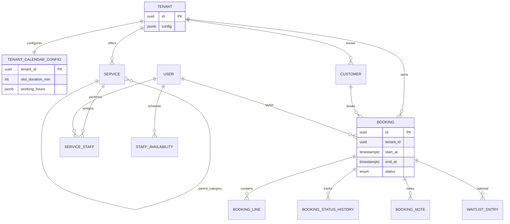

# Database Design — Booking & Calendar (Multi-Tenant)

**Status:** Design baseline for implementation (not migrated yet)  
**Principle:** Every operational table includes `tenant_id`. Calendar rules are **per tenant** (one salon = one tenant). Staff/stylists are `user` rows in that tenant.

**Related:** [Appointment-Domain-Challenges.md](./Appointment-Domain-Challenges.md), [user-stories/04](./user-stories/04-service-availability.md), [user-stories/05](./user-stories/05-booking-operations.md)

---

## 1. Design principles

| Rule | Implementation |
| --- | --- |
| Tenant isolation | `tenant_id UUID NOT NULL` on all booking-domain tables; `TenantAwareRepository` only |
| Calendar ownership | One `tenant_calendar_config` row per tenant; staff overrides do not replace tenant defaults |
| Time storage | All instants as `TIMESTAMPTZ` (UTC in DB); canonical TZ = `tenant_calendar_config.timezone` via `TimezoneService` — see [Calendar-Booking-Solutions.md](./Calendar-Booking-Solutions.md) §1 |
| Soft delete | `deleted_at` on mutable entities (same as `user`, `role`) |
| Audit | `created_by`, `updated_by`, `created_at`, `updated_at` via base entities |
| Double booking | **GiST exclusion** on `(tenant_id, staff_id, tstzrange)` + app `assertSlotAvailable()` — see [Calendar-Booking-Solutions.md](./Calendar-Booking-Solutions.md) §2 |
| Snapshots | `policy_snapshot`, `pricing_snapshot` on `booking` at create time (immutable history) |
| Staff resource | MVP: one primary resource per booking = `staff_id` → `user.id` |

**Existing tables (unchanged):** `tenant`, `user`, `role`, `token`, `otp`.

---

## 2. Domain overview



---

## 3. Tables — calendar & catalog (Phase 1)

### 3.1 `tenant_calendar_config` (1:1 per tenant)

**Feature:** Salon-wide calendar — working hours, default slot size, buffers, holidays/closures.  
**Not shared across tenants.**

| Column | Type | Nullable | Description |
| --- | --- | --- | --- |
| `tenant_id` | UUID | NO | **PK**, FK → `tenant.id` |
| `timezone` | VARCHAR(64) | NO | IANA e.g. `Asia/Kolkata` (can mirror `tenant.config` but stored for engine) |
| `slot_duration_min` | INT | NO | Default grid step (e.g. 15) |
| `buffer_before_min` | INT | NO | Default prep before appointment |
| `buffer_after_min` | INT | NO | Cleanup after (feeds next slot) |
| `working_hours` | JSONB | NO | Weekly template (see §3.1.1) |
| `day_overrides` | JSONB | NO | Default `[]` — closures/holidays/special hours |
| `booking_hold_minutes` | INT | NO | Default 5 — pending payment hold |
| `min_booking_notice_min` | INT | NO | Earliest bookable time from now |
| `max_booking_days_ahead` | INT | NO | e.g. 30 |
| `created_by` … `deleted_at` | | | Standard audit (use `BaseTenantModifiableEntityWithoutIdentity` with PK = tenant_id) |

**Indexes:** PK on `tenant_id` only.

**Seed:** On `POST /tenants` or tenant activate → insert default Mon–Sat 9–21, 15-min slots, IST.

#### 3.1.1 `working_hours` JSON schema

```json
{
  "monday":    { "isOpen": true,  "open": "09:00", "close": "21:00", "breaks": [{ "start": "13:00", "end": "14:00" }] },
  "tuesday":   { "isOpen": true,  "open": "09:00", "close": "21:00", "breaks": [] },
  "wednesday": { "isOpen": true,  "open": "09:00", "close": "21:00", "breaks": [] },
  "thursday":  { "isOpen": true,  "open": "09:00", "close": "21:00", "breaks": [] },
  "friday":    { "isOpen": true,  "open": "09:00", "close": "21:00", "breaks": [] },
  "saturday":  { "isOpen": true,  "open": "09:00", "close": "20:00", "breaks": [] },
  "sunday":    { "isOpen": false, "open": null,    "close": null,    "breaks": [] }
}
```

Times are **local to `timezone`** (not UTC strings).

#### 3.1.2 `day_overrides` JSON schema

```json
[
  {
    "date": "2026-08-15",
    "type": "closed",
    "reason": "Independence Day"
  },
  {
    "date": "2026-12-24",
    "type": "special_hours",
    "open": "10:00",
    "close": "14:00",
    "breaks": []
  }
]
```

---

### 3.2 `service` (catalog)

**Feature:** What can be booked — categories + leaf services, duration, price, active flag.

| Column | Type | Nullable | Description |
| --- | --- | --- | --- |
| `id` | UUID | NO | PK |
| `tenant_id` | UUID | NO | FK logical |
| `parent_id` | UUID | YES | Self-FK category tree; NULL = root category or top-level service |
| `name` | VARCHAR(255) | NO | |
| `description` | TEXT | YES | HTML allowed; sanitize on write |
| `service_type` | ENUM | NO | `category`, `service` |
| `duration_min` | INT | YES | Required when `service_type = service` |
| `completion_buffer_min` | INT | NO | Default 0; after service ends |
| `base_price` | DECIMAL(12,2) | YES | Required for bookable service |
| `tax_percent` | DECIMAL(5,2) | NO | Default 0 |
| `image_url` | VARCHAR(500) | YES | |
| `sort_order` | INT | NO | Default 0 |
| `is_active` | BOOLEAN | NO | Default true |
| audit columns | | | `BaseTenantModifiableEntity` |

**Indexes:**

- `(tenant_id, is_active, service_type)`
- `(tenant_id, parent_id)`
- Unique `(tenant_id, name, parent_id, deleted_at)` — optional UK

**Features enabled:**

- Service catalog UI
- Duration sum for availability engine
- Pricing snapshot on booking lines

---

### 3.3 `service_staff` (stylist ↔ service)

**Feature:** Which stylists can perform which service (replaces `uuid[]` for queryability).

| Column | Type | Nullable |
| --- | --- | --- |
| `id` | UUID | NO PK |
| `tenant_id` | UUID | NO |
| `service_id` | UUID | NO FK → `service.id` |
| `staff_id` | UUID | NO FK → `user.id` |
| audit + `deleted_at` | | |

**Indexes:**

- Unique `(tenant_id, service_id, staff_id, deleted_at)`
- `(tenant_id, staff_id)`

---

### 3.4 `staff_availability` (per-stylist exceptions)

**Feature:** Leave, extra shift, breaks — **scoped to tenant + staff**; validated against `tenant_calendar_config`.

| Column | Type | Nullable | Description |
| --- | --- | --- | --- |
| `id` | UUID | NO | PK |
| `tenant_id` | UUID | NO | |
| `staff_id` | UUID | NO | `user.id` |
| `date` | DATE | NO | Local date in tenant TZ |
| `exception_type` | ENUM | NO | `leave`, `break`, `extra_hours` |
| `windows` | JSONB | NO | See below |
| `admin_override` | BOOLEAN | NO | Bypass salon-hour validation |
| `note` | VARCHAR(500) | YES | |
| audit + `deleted_at` | | | |

**Indexes:** Unique `(tenant_id, staff_id, date, exception_type, deleted_at)` — or one row per date with merged windows (prefer **one row per date**).

**`windows` example (leave):**

```json
{ "allDay": true }
```

**`windows` example (extra_hours):**

```json
{ "slots": [{ "start": "18:00", "end": "21:00" }] }
```

---

## 4. Tables — customers & bookings (Phase 2)

### 4.1 `customer` (tenant-scoped guest)

**Feature:** CRM per salon; phone-centric India flows; optional link to auth `user`.

| Column | Type | Nullable |
| --- | --- | --- |
| `id` | UUID | NO PK |
| `tenant_id` | UUID | NO |
| `user_id` | UUID | YES | Platform login user |
| `first_name` | VARCHAR(100) | YES |
| `last_name` | VARCHAR(100) | YES |
| `phone` | VARCHAR(15) | NO |
| `email` | VARCHAR(50) | YES |
| `whatsapp` | VARCHAR(15) | YES |
| `reputation_flags` | JSONB | NO | `{ "vip": false, "advancePayRequired": false, "risk": false }` |
| audit + `deleted_at` | | |

**Indexes:** Unique `(tenant_id, phone, deleted_at)`

---

### 4.2 `booking` (appointment)

**Feature:** Single appointment record — channel-agnostic, concurrency-safe.

| Column | Type | Nullable | Description |
| --- | --- | --- | --- |
| `id` | UUID | NO | PK |
| `tenant_id` | UUID | NO | |
| `reference_id` | VARCHAR(12) | NO | Human-friendly; unique per tenant |
| `status` | ENUM | NO | See §4.2.1 |
| `channel` | ENUM | NO | `app`, `web`, `whatsapp`, `phone`, `walk_in` |
| `customer_id` | UUID | YES | FK → `customer` |
| `guest_snapshot` | JSONB | YES | `{ firstName, lastName, phone }` walk-in |
| `staff_id` | UUID | YES | FK → `user` (stylist) |
| `start_at` | TIMESTAMPTZ | NO | UTC |
| `end_at` | TIMESTAMPTZ | NO | UTC (includes buffers) |
| `hold_expires_at` | TIMESTAMPTZ | YES | Payment hold expiry |
| `policy_snapshot` | JSONB | NO | Cancel/reschedule rules at book time |
| `pricing_snapshot` | JSONB | NO | Totals + line breakdown |
| `cancel_reason` | TEXT | YES | |
| `cancelled_at` | TIMESTAMPTZ | YES | |
| `version` | INT | NO | Default 0 — optimistic locking |
| audit + `deleted_at` | | | |

#### 4.2.1 `booking.status` enum

| Value | Meaning | Blocks slot? |
| --- | --- | --- |
| `pending` | Created; awaiting payment/confirm | **Yes** |
| `confirmed` | Paid or admin-confirmed | **Yes** |
| `checked_in` | Guest arrived | **Yes** |
| `servicing` | In chair | **Yes** |
| `completed` | Done | No |
| `cancelled` | Cancelled | No |
| `no_show` | Marked absent | No |
| `expired` | Hold timed out | No |

**Slot-blocking statuses for overlap query:** `pending`, `confirmed`, `checked_in`, `servicing`.

**Overlap enforcement (GiST):**

```sql
ALTER TABLE booking
ADD CONSTRAINT booking_no_staff_overlap
EXCLUDE USING gist (
  tenant_id WITH =,
  staff_id  WITH =,
  tstzrange(start_at, end_at, '[)') WITH &&
)
WHERE (
  deleted_at IS NULL
  AND staff_id IS NOT NULL
  AND status IN ('pending', 'confirmed', 'checked_in', 'servicing')
);
```

Requires `btree_gist` extension: `CREATE EXTENSION IF NOT EXISTS btree_gist;`

Map Postgres `exclusion_violation` → HTTP 409 `ERR_SLOT_CONFLICT`.

**Indexes (critical for concurrency & calendar):**

```sql
CREATE UNIQUE INDEX uk_booking_tenant_reference
  ON booking (tenant_id, reference_id) WHERE deleted_at IS NULL;

CREATE INDEX idx_booking_tenant_staff_time
  ON booking (tenant_id, staff_id, start_at, end_at)
  WHERE deleted_at IS NULL;

CREATE INDEX idx_booking_tenant_start_status
  ON booking (tenant_id, start_at, status)
  WHERE deleted_at IS NULL;

CREATE INDEX idx_booking_tenant_customer
  ON booking (tenant_id, customer_id, start_at)
  WHERE deleted_at IS NULL;
```

---

### 4.3 `booking_line`

**Feature:** One row per service in a appointment; immutable price/duration at booking time.

| Column | Type | Nullable |
| --- | --- | --- |
| `id` | UUID | NO PK |
| `tenant_id` | UUID | NO |
| `booking_id` | UUID | NO |
| `service_id` | UUID | NO |
| `service_name` | VARCHAR(255) | NO | Snapshot |
| `duration_min` | INT | NO | Snapshot |
| `unit_price` | DECIMAL(12,2) | NO | Snapshot |
| `tax_percent` | DECIMAL(5,2) | NO | Snapshot |
| `line_total` | DECIMAL(12,2) | NO | |
| `sort_order` | INT | NO | |

**Index:** `(tenant_id, booking_id)`

---

### 4.4 `booking_status_history`

**Feature:** Audit trail / compliance / staff timeline.

| Column | Type | Nullable |
| --- | --- | --- |
| `id` | UUID | NO PK |
| `tenant_id` | UUID | NO |
| `booking_id` | UUID | NO |
| `from_status` | ENUM | YES | NULL on create |
| `to_status` | ENUM | NO |
| `changed_by` | UUID | YES | user id |
| `changed_at` | TIMESTAMPTZ | NO | Default now() |
| `metadata` | JSONB | YES | e.g. reschedule reason |

**Index:** `(tenant_id, booking_id, changed_at)`

---

### 4.5 `booking_note`

| Column | Type | Nullable |
| --- | --- | --- |
| `id` | UUID | NO PK |
| `tenant_id` | UUID | NO |
| `booking_id` | UUID | NO |
| `text` | TEXT | NO |
| `is_internal` | BOOLEAN | NO | Default true |
| `author_id` | UUID | YES | |
| audit | | |

---

### 4.6 `waitlist_entry` (Phase 2b)

| Column | Type | Nullable |
| --- | --- | --- |
| `id` | UUID | NO PK |
| `tenant_id` | UUID | NO |
| `customer_id` | UUID | NO |
| `staff_id` | UUID | YES | Preferred stylist |
| `service_ids` | JSONB | NO | UUID array |
| `desired_date` | DATE | YES | Local tenant date |
| `position` | INT | NO | Queue order |
| `status` | ENUM | NO | `waiting`, `notified`, `booked`, `expired` |
| `booking_id` | UUID | YES | Set when converted |
| audit | | |

**Index:** `(tenant_id, status, position)`

---

## 5. What each layer provides (feature map)

| Feature | Tables | Engine / service |
| --- | --- | --- |
| Per-tenant business hours | `tenant_calendar_config` | AvailabilityEngine |
| Holiday / special day | `day_overrides` | AvailabilityEngine |
| Service menu + pricing | `service`, `service_staff` | CatalogService |
| Stylist can do service X | `service_staff` | Catalog + booking validation |
| Stylist on leave | `staff_availability` | AvailabilityEngine |
| Suggest open slots | All above + `booking` | `AvailabilityEngine.suggestSlots()` |
| Book appointment | `booking`, `booking_line`, history | BookingService + TX lock |
| Prevent double book | `booking` indexes + `FOR UPDATE` | BookingRepository |
| Salon calendar view | `booking` | BookingService.listByRange() |
| Staff today agenda | `booking` | Filter by staff + date |
| Walk-in guest | `guest_snapshot` | No customer row required |
| Payment hold | `hold_expires_at`, `status=pending` | PaymentService (Phase 3) |
| Cancel / release slot | `status=cancelled` | BookingService |
| Waitlist on cancel | `waitlist_entry` | WaitlistJob |
| Policy at book time | `policy_snapshot` | PolicyService (Phase 12) or defaults |

---

## 6. API implementation map

All APIs below require **`x-tenant` / `x-tenant-id`** except where noted.  
Implement as Nest modules: `calendar` (config), `service` (catalog), `availability` (read), `booking` (write).

### 6.1 Phase 1 — Calendar & catalog APIs

| API | Method | Reads | Writes | DB feature |
| --- | --- | --- | --- | --- |
| Get calendar config | `GET /slots/config` | `tenant_calendar_config` | — | Per-tenant hours/buffers |
| Update calendar config | `PUT /slots/config` | config | `tenant_calendar_config` | Admin sets salon calendar |
| Service catalog | `GET /services/catalog` | `service`, `service_staff` | — | Tree + staff |
| Create service | `POST /services` | — | `service` | Menu item |
| Update service | `PUT /services/:id` | service | `service` | Edit |
| Activate / deactivate | `PUT /services/:id/activate` | — | `service.is_active` | Toggle |
| Assign staff to service | `PUT /services/:id/staff` | — | `service_staff` | Stylist linkage |
| Staff availability list | `GET /staff/:staffId/availability` | `staff_availability` | — | Leave/break |
| Set staff availability | `POST /staff/:staffId/availability` | config (validate) | `staff_availability` | Exception days |
| **Suggest slots** | `GET /availability/slots` | config, services, staff_availability, booking | — | **Core engine** (read-only) |

**`GET /availability/slots` query params**

| Param | Required | Description |
| --- | --- | --- |
| `serviceIds` | Yes | Comma-separated UUIDs |
| `staffId` | No | Filter stylist |
| `from` | Yes | ISO date or datetime (tenant TZ interpreted) |
| `to` | No | Default from + 7 days |
| `limit` | No | Max slots returned (default 20) |

**Response item:**

```json
{
  "startAt": "2026-05-21T09:00:00.000Z",
  "endAt": "2026-05-21T09:45:00.000Z",
  "staffId": "uuid",
  "staffName": "Amit"
}
```

**Internal service (no HTTP required):**

```typescript
AvailabilityEngine.suggestSlots(params): SlotSuggestion[]
AvailabilityEngine.assertSlotAvailable(params): void // throws ERR_SLOT_CONFLICT
```

---

### 6.2 Phase 2 — Booking APIs

| API | Method | Reads | Writes | Transaction |
| --- | --- | --- | --- | --- |
| List calendar | `GET /bookings` | `booking`, lines, customer | — | No |
| Create booking | `POST /bookings` | engine, customer | booking, lines, history | **Yes** + `FOR UPDATE` |
| Get booking | `GET /bookings/:id` | all booking tables | — | No |
| Reschedule | `PUT /bookings/:id/reschedule` | engine | booking, history | **Yes** |
| Cancel | `DELETE /bookings/:id` | policy | booking, history | **Yes** |
| Patch status | `PATCH /bookings/:id/status` | booking | booking, history | **Yes** |
| Add note | `POST /bookings/:id/notes` | — | `booking_note` | No |
| By reference | `GET /bookings/reference/:ref` | booking | — | No |
| Enqueue waitlist | `POST /bookings/:id/waitlist` | — | `waitlist_entry` | No |

**`POST /bookings` flow (developer):**

```text
1. Resolve tenantId from AsyncContext (never from body)
2. Load tenant_calendar_config
3. AvailabilityEngine.assertSlotAvailable(staffId, startAt, serviceIds)
4. BEGIN TRANSACTION
5. SELECT overlapping bookings FOR UPDATE
6. INSERT booking (status=pending, hold_expires_at=now+hold_minutes)
7. INSERT booking_line rows from pricing calculator
8. INSERT booking_status_history (null → pending)
9. COMMIT
10. Return 201 + referenceId
```

---

### 6.3 Phase 3 — Payment & notifications (DB touch)

| API | Writes |
| --- | --- |
| `POST /bookings/:id/pay` | `booking.status`, optional `payment` table |
| `POST /bookings/:id/otp-verify` | booking metadata |
| Cron: expire holds | `booking.status → expired` where `hold_expires_at < now()` |

**`payment` table (Phase 3):** `tenant_id`, `booking_id`, `amount`, `provider`, `provider_ref`, `status`, `idempotency_key` UK.

---

## 7. Multi-tenant calendar behavior (examples)

| Scenario | Behavior |
| --- | --- |
| Tenant A and B | Separate `tenant_calendar_config` rows; no shared hours |
| Stylist moves tenant | Not supported — `user.tenant_id` is fixed |
| PO views all tenants | `@TenantApi()` tenant CRUD only; booking APIs always scoped |
| Customer books Tenant A | Header `x-tenant: A`; customer row in Tenant A |
| Admin edits hours | `PUT /slots/config` updates only current tenant from header |

**Extend `tenant.config` (JSON) for non-calendar flags:**

```json
{
  "timezone": "Asia/Kolkata",
  "locale": "en-IN",
  "branding": { "primaryColor": "#..." }
}
```

**Calendar-specific fields stay in `tenant_calendar_config`** so the availability engine has one table to load.

---

## 8. Migration order

| Step | Migration | Tables |
| --- | --- | --- |
| M1 | `*-tenant-calendar-and-service` | `tenant_calendar_config`, `service`, `service_staff` |
| M2 | `*-staff-availability` | `staff_availability` |
| M3 | `*-customer` | `customer` |
| M4 | `*-booking-core` | `booking`, `booking_line`, `booking_status_history`, `booking_note` |
| M5 | `*-waitlist` | `waitlist_entry` |
| M6 | `*-payment` | `payment` (Phase 3) |

**Seeder:** default `tenant_calendar_config` for existing tenants in dev.

---

## 9. Module & permission constants (implementers)

| Nest module | `MODULE_CONSTANTS` | Controller prefix |
| --- | --- | --- |
| Calendar | `CALENDAR` or `SLOT` | `/slots` |
| Service | `SERVICE` | `/services` |
| Availability | — (internal) | `/availability` |
| Booking | `BOOKING` | `/bookings` |
| Customer | `CUSTOMER` | `/customers` |

---

## 10. Implementation sequence (recommended)

```text
Week A — DB M1–M2 + entities + GET/PUT /slots/config + service CRUD
Week B — staff availability + AvailabilityEngine + GET /availability/slots
Week C — DB M3–M4 + POST/GET /bookings + overlap locking
Week D — reschedule/cancel/PATCH status + history + notes
```

---

## 11. Open decisions

| ID | Question | Recommendation |
| --- | --- | --- |
| DB-01 | Table name `tenant_calendar_config` vs `slot_config` | Use `tenant_calendar_config`; keep API path `/slots/config` |
| DB-02 | `service_staff` join vs `uuid[]` on service | Join table (chosen) |
| DB-03 | Single vs multiple `staff_availability` rows per date | One row per staff per date |
| DB-04 | `reference_id` format | `BK` + 8 alphanumeric per tenant |

---

*When migrations are generated, update [implementation-baseline.md](../.cursor/skills/anvix-requirements/implementation-baseline.md) and user-stories 04/05.*
