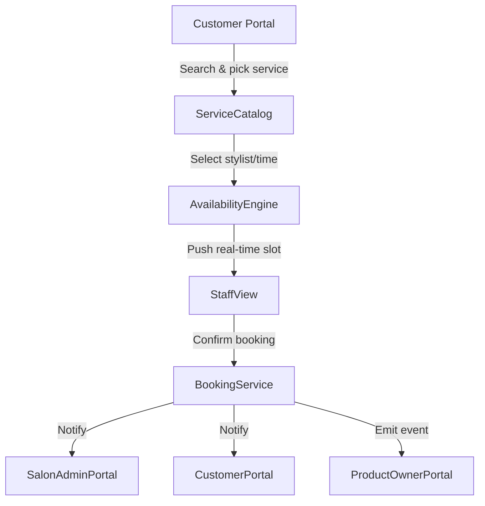
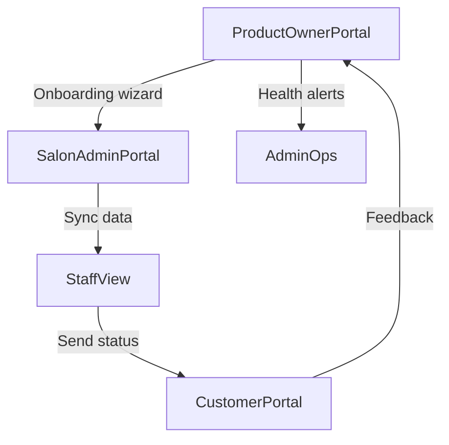

# Indian Salon Booking Requirements (Backend Perspective)

_As the Senior Backend Expert for the appointment booking domain, I am translating your business goals into a detailed set of requirements that addresses the current pain points in the Indian salon ecosystem. This document focuses on the data flows, integrations, and real-time guarantees needed for the four portals (Salon Admin, Customer, Staff, and Product Owner) plus the product gaps that must be closed for a differentiated offering._

## Objectives
- Deliver a booking system that feels real-time even in bandwidth-constrained Indian metro and tier-2 markets.
- Support a multi-tenant SaaS model where a single product owner portal can onboard salons as isolated tenants with their own admin/staff/customer experiences.
- Provide full visibility across the appointment lifecycle—from product owner onboarding, to salon admin controls, to staff execution and customer engagement.

## Key Portals

### Salon Admin Portal
**Purpose:** Give salon managers a live, consolidated command center for inventory, staff, slots, and revenue across services.

**Key workflows & features:**
- Multi-service catalog management (e.g., hair, spa, thread) with slots, price variants, and add-ons.
- Live booking monitor that shows confirmed, tentative, and arriving customers with status badges.
- Staff scheduling grid integrated with real-time availability pushes to staff mobile apps and customer portal (via WebSockets/Server-Sent Events).
- Payment settlement dashboard that tracks in-store and online payments, including GST-compliant invoices.
- Dispute resolution log for walk-in vs. online no-shows, refunds, and tip adjustments.

### Customer Portal
**Purpose:** Make salon discovery, booking, rescheduling, and loyalty frictionless, even on feature phones or low-bandwidth networks.

**Key workflows & features:**
- Search filters (location, service, preferred stylist, price) with rich cards triggered by geolocation and business hours.
- Real-time slot availability (note: update within 2 seconds of other bookings) using polling fallback or push notifications.
- Multi-channel appointment creation (app/web/WhatsApp) with a unified reference ID.
- Two-way reminders (SMS + push) and easy reschedule/cancel with transparent refund rules.
- Loyalty management tied to a customer profile (points, tier, spent history) and integrated digital wallet (optional).

### Staff View
**Purpose:** Equip individual staff members with their upcoming deck, client history, and service prompts.

**Key workflows & features:**
- Daily agenda sorted by priority, allowing drag-and-drop reordering for walk-ins or emergencies.
- Client profiles showing past services, allergies, notes, and customer-tier indicators.
- Quick status updates (checked-in, seated, servicing, closed) that sync back to the salon admin live view.
- In-app communication channel for admins to broadcast urgent announcements (e.g., queue overflow).
- Tip logging and commission reports pushed to their payroll module.

### Product Owner Portal
**Purpose:** Onboard and monitor salon tenants, enforce compliance, and manage the SaaS configuration.

**Key workflows & features:**
- Tenant onboarding wizard (documents collection, GST/PAN, contract e-sign, payment plan selection).
- Health dashboard showing tenant adoption, booking volume, retention, and SLA violations.
- Policy controls (cancellation rules, service tax rates, loyalty tiers) that are optionally templated per zone/state.
- Infrastructure monitoring (API latency, WebSocket connection counts) for the tenant's live services.
- Customer support queue for handling escalations from salons or customers (with triage tags).

## Gap Analysis & Value-Add Features
| Gap | Proposed Feature | Value Hypothesis |
| --- | --- | --- |
| Real-time slot conflicts | Optimistic locking + event bus + realtime push to customer/staff views | Avoids double bookings, builds trust during peak hours |
| Fragmented payments (cash vs. online) | Unified settlement ledger with payouts per salon | Streamlines accounting and reconciliation for franchise chains |
| Inconsistent staff utilization data | Staff analytics + utilization heatmaps | Helps salons plan shift rotations and promotions |
| Poor onboarding discipline | Product owner portal with checklist, reminders, compliance documents | Reduces churn during activation, ensures trust |
| Limited discovery from local search | Integrated hyperlocal discovery (Google Business + WhatsApp catalog) | Increases reach for tier-2 salons and mobile-first users |
| Loyalty opacity | Tiered loyalty engine tied to customer profile + wallet | Drives repeat visits and more predictable revenue |
| Lack of accountability | Audit trails + service-level alerts for each portal | Gives product owner quick view of SLA breaches and escalations |

## Real-time & Reliability Considerations
- **Event-driven architecture:** Use Kafka or RabbitMQ to propagate booking lifecycle events (created, confirmed, in-progress, completed) to all portals.
- **Presence & heartbeat:** Maintain staff/campus presence via WebSocket sessions; degrade gracefully to polling if connection drops.
- **Idempotency keys:** Ensure retries (especially from WhatsApp or SMS-based bookings) never duplicate appointments.
- **Data residency:** Since targeting India, ensure GST data and customer PII remain within Indian-region data stores (e.g., designated DB shards).

## Flow Diagrams (Mermaid)

### High-level booking lifecycle

### Tenant onboarding & monitoring

## Tracking & Next Steps
- Progress is tracked in `requirements/progress-log.md`, which captures milestones such as onboarding this discovery phase and next deliverables.
- Next: Validate these requirements with your product team, identify API/service ownership, and prioritize which portal to build first (recommend starting with Salon Admin + Customer portal MVP to validate availability layer).
